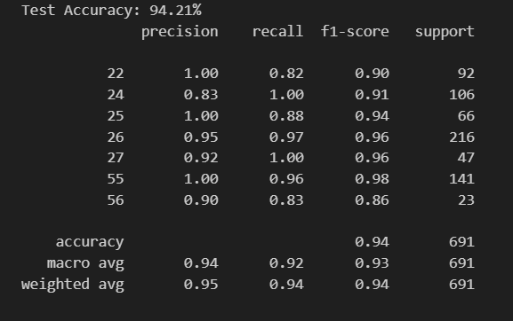

# Traffic Sign Recognition using SVM and HOG

## Overview
This project implements a **Traffic Sign Recognition System** using **Support Vector Machines (SVM)** and **Histogram of Oriented Gradients (HOG)** for feature extraction. The system can classify traffic signs from images, preprocess them, and predict their labels using a trained SVM model.

## Features
- Annotation Parsing
- Image Preprocessing and Augmentation
- Feature Extraction using HOG
- SVM Model Training and Prediction
- Test Dataset Evaluation
- GUI for Real-time Image Prediction

## Results Screenshot
Below is an example of the results obtained from the model:


## Dataset
- **Training Dataset:** `TSRD_Train`
- **Test Dataset:** `TSRD_Test`
- **Annotation File:** `TSRD_Train_Annotation/TsignRecgTrain4170Annotation.txt`

## Dependencies
Make sure the following Python libraries are installed:
- `numpy`
- `opencv-python`
- `scikit-learn`
- `scikit-image`
- `joblib`
- `tkinter`
- `Pillow`
You can install them using:
```bash
pip install numpy opencv-python scikit-learn scikit-image joblib Pillow
```
Make sure to download the Datasets

## Dataset
- **Drive link:**
   https://drive.google.com/drive/folders/1oYpmygK2PNuZyR8IQxGokIlMHMrDE0SX
- **References:**
   - https://nlpr.ia.ac.cn/pal/trafficdata/recognition.html 
   - https://universe.roboflow.com/usmanchaudhry622-gmail-com/traffic-and-road-signs 


## Folder Structure 
```
├── TSRD_Train                               # Training dataset
├── TSRD_Test                                # Test dataset
├── TSRD_Train_Annotation
│   ├── TsignRecgTrain4170Annotation.txt     # Trainig dataset annotations
├── trained_model.pkl                        # Saved SVM model
├── commonfunctions.py                       # imports and common functions
├── project.ipynb                            # Main code
├── DatasetManipulation.ipynb                # Manipulating datasets
└── README.md                                # Project documentation
├── .gitignore                               # To avoid uploading the dataset
```

## How to Run
1. **Train the Model:**
   Run the main script to train the SVM model.
   ```bash
   project.ipynb
   ```
2. **Evaluate the Model:**
   The accuracy and classification report will be displayed.
3. **Use GUI for Predictions:**
   Run the GUI cell.
   - Click **'Load Image'** to select an image.
   - Click **'Predict'** to see the traffic sign classification result.

## Key Functions
- `parse_annotations`: Parses the dataset annotation file.
- `load_images`: Loads images from the dataset.
- `augment_image`: Performs image augmentation.
- `preprocess_images`: Applies preprocessing (grayscale, Gaussian blur, morphology).
- `extract_hog_features`: Extracts HOG features.
- `train`: Trains an SVM classifier.
- `predict`: Predicts traffic sign labels.

## GUI Interface
- **Load Image:** Browse and select an image.
- **Predict:** Classify the image and display the traffic sign label.

## Model Details
- **Classifier:** Support Vector Machine (SVM)
- **Kernel:** Linear
- **C:** 0.001

---
For any issues or suggestions, please feel free to open an issue or contact us.

